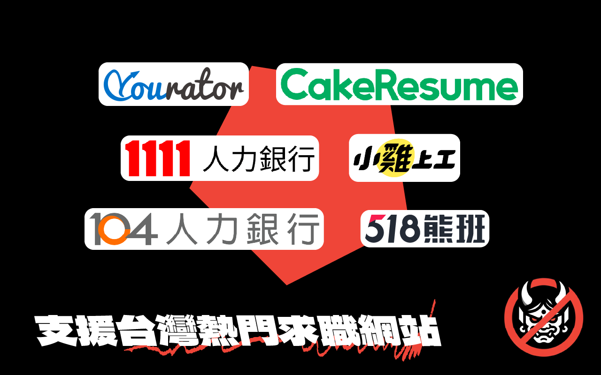

  

  <a href="http://taiwan-company-blocker.ngseke.me/" target="_blank">
    台灣求職網封鎖神器
  </a>

  
  
  
  

# Taiwan Company Blocker

## Install from Chrome Web Store

## Support Employment Websites

1. [Cake (Formerly CakeResume)](https://www.cake.me/)
1. [Yourator](https://www.yourator.co/)
1. [104 人力銀行](https://www.104.com.tw/)
1. [518 熊班](https://www.518.com.tw/)
1. [1111 人力銀行](https://www.1111.com.tw/)
1. [小雞上工](https://www.chickpt.com.tw/)
1. [Meet.jobs](https://meet.jobs/)
1. [台灣就業通](https://job.taiwanjobs.gov.tw/)

## Recommended Subscription Source

- https://github.com/ngseke/company-list

## Features

